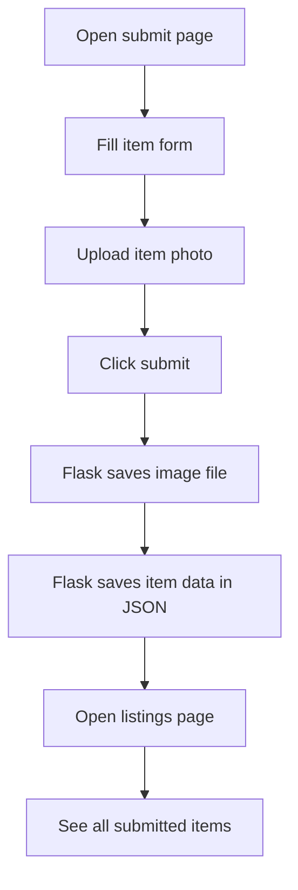

## 1. Product Overview
This project is a beginner-friendly Lost & Found website for students.
- It helps students submit found-item details and view all submitted items in one simple place.
- It is designed for teaching a 9th-grade student how a Flask web app works without adding database complexity too early.

## 2. Core Features

### 2.1 Feature Module
1. **Submit Item Page**: item form, photo upload, save button, simple success feedback
2. **Items Listing Page**: item cards, uploaded photo preview, found-date display

### 2.2 Page Details
| Page Name | Module Name | Feature description |
|-----------|-------------|---------------------|
| Submit Item Page | Header | Shows project title and a short beginner-friendly explanation |
| Submit Item Page | Item Form | Collects item name, description, photo, where it was found, and found date |
| Submit Item Page | Save Flow | Sends form data to Flask and stores item data in a local JSON file |
| Submit Item Page | Navigation | Lets the student move to the listings page easily |
| Items Listing Page | Header | Explains that all saved items appear here |
| Items Listing Page | Item Cards | Displays each item with name, description, location, date, and photo |
| Items Listing Page | Empty State | Shows a helpful message if no items have been submitted yet |
| Items Listing Page | Navigation | Provides a clear link back to the submit page |

## 3. Core Process
The main user flow is simple: a student opens the submit page, fills in the item details, uploads a photo, and clicks submit. The Flask server saves the image in a local uploads folder and saves the item details in a local JSON file. Then the student can open the listings page and see every saved item.

## 4. User Interface Design
### 4.1 Design Style
- Primary color: deep blue
- Secondary color: soft sky blue
- Accent color: warm yellow for highlights
- Button style: rounded buttons with a simple hover effect
- Font style: clean system fonts for easy readability
- Layout style: centered content area with card sections and generous spacing
- Visual tone: clean, calm, school-friendly, and easy to understand

### 4.2 Page Design Overview
| Page Name | Module Name | UI Elements |
|-----------|-------------|-------------|
| Submit Item Page | Form Card | White card, rounded corners, shadow, labeled inputs, simple spacing |
| Submit Item Page | Page Header | Large title, short subtitle, small navigation links |
| Items Listing Page | Item Grid | Responsive card layout with image on top and text below |
| Items Listing Page | Empty State | Friendly message card with suggestion to add the first item |

### 4.3 Responsiveness
- Desktop-first layout for classroom teaching
- Mobile-friendly stacking for smaller screens
- Large tap targets and readable spacing
- Simple form layout with one column on smaller screens
