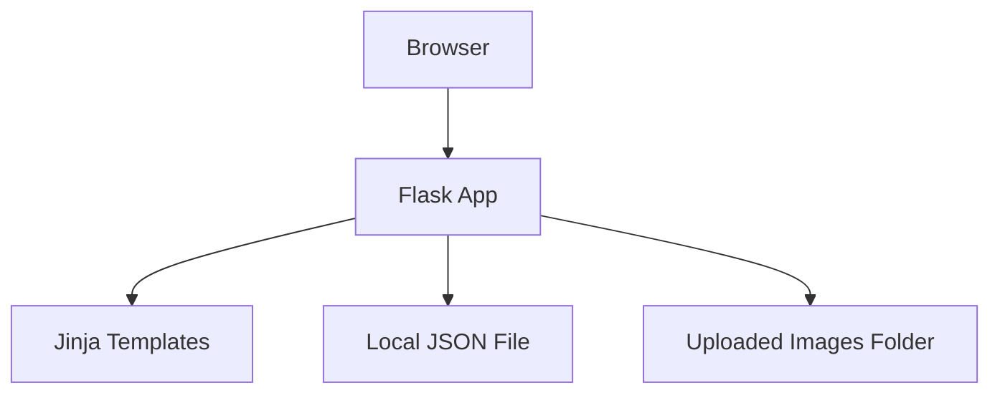
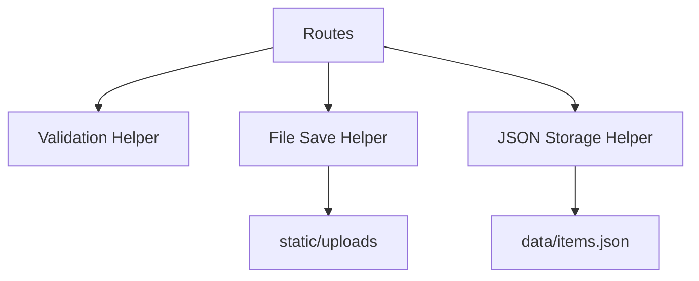
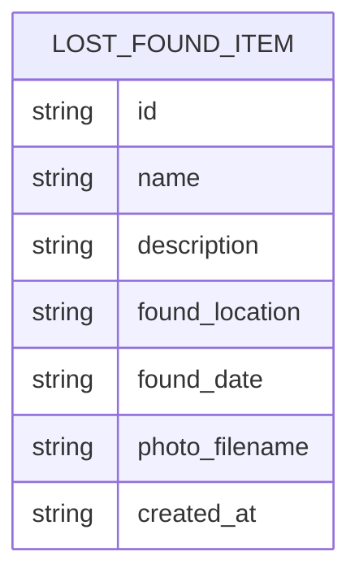

## 1. Architecture Design


## 2. Technology Description
- Backend: Python 3 + Flask
- Frontend: HTML templates + Jinja + CSS
- Storage: local JSON file for item data
- File storage: local folder inside `static/uploads`
- Environment tool: `uv`
- Deployment path for later classes: can move to Render after local version works

## 3. Route Definitions
| Route | Purpose |
|-------|---------|
| `/` | Show the submit item form |
| `/submit` | Receive form data and save the item |
| `/items` | Show all saved items |

## 4. API Definitions
This version does not need a public JSON API yet because it is focused on Class 3 learning goals. The app uses standard Flask form submission and server-rendered pages.

### Form Fields
```python
class LostFoundItem(TypedDict):
    id: str
    name: str
    description: str
    found_location: str
    found_date: str
    photo_filename: str
    created_at: str
```

## 5. Server Architecture Diagram


## 6. Data Model
### 6.1 Data Model Definition


### 6.2 Data Definition Notes
- `data/items.json` stores a list of submitted items
- Each item is saved as a dictionary with simple string values
- Photos are saved in `static/uploads`
- A unique filename is generated to avoid photo name collisions
- If the JSON file does not exist yet, the app creates it automatically

## 7. Teaching Notes
- Keep logic in one main Flask file first so the student can follow it
- Add clear comments only where the code needs explanation
- Avoid database setup for now
- Keep HTML templates small and readable
- Use simple CSS instead of complex frameworks so the student can connect style changes to visible results
